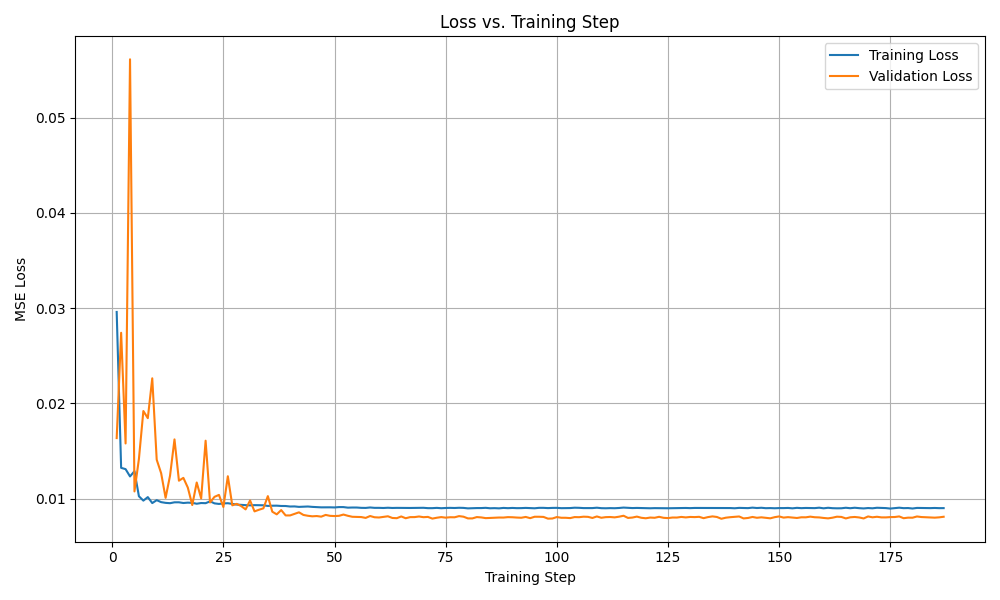
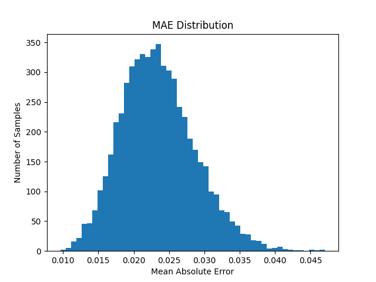
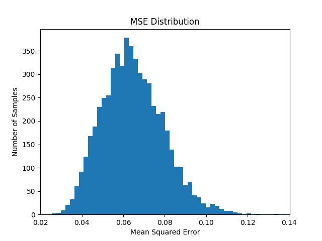
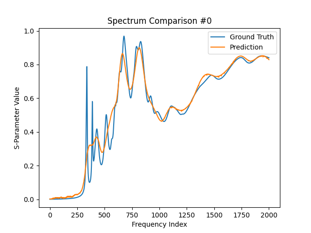
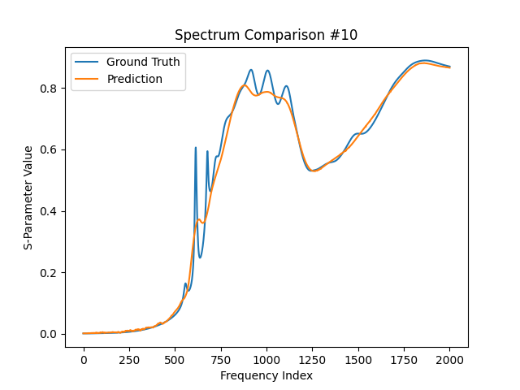
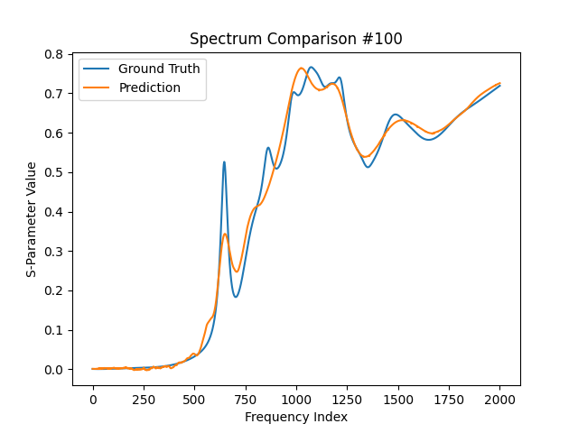

---

## Model & Training Overview

### 🔧 Input/Output
- **Inputs (`data_g.csv`)**: 14-dimensional geometry vector
- **Outputs (`data_s.csv`)**: 2001-dimensional spectral response vector (S-parameters)

### 🧠 MLP Architecture
- 10 hidden layers with 2000 neurons each
- Activation: **GELU**
- Regularization: **Dropout (0.2)** and **BatchNorm**
- Skip Connections: Enabled from 2nd layer onward
- Trainable Parameters: **40M+**


```bash

MLP(
  (dropout): Dropout(p=0.2, inplace=False)
  (activation): GELU(approximate='none')
  (linears): ModuleList(
    (0): Linear(in_features=14, out_features=2000, bias=True)
    (1-9): 9 x Linear(in_features=2000, out_features=2000, bias=True)
    (10): Linear(in_features=2000, out_features=2001, bias=True)
  )
  (bns): ModuleList(
    (0-9): 10 x BatchNorm1d(2000, eps=1e-05, momentum=0.1, affine=True, track_running_stats=True)
  )
)


```

### Training Configuration
| Setting              | Value         |
|---------------------|---------------|
| Optimizer           | Adam          |
| Learning Rate       | 1e-3          |
| Batch Size          | 256           |
| Weight Decay        | 1e-5          |
| LR Decay (plateau)  | 0.5           |
| Max Epochs          | 500           |
| Early Stopping Patience | 50       |

---

## Results & Analysis

### Training Curve



- **Observation**: Validation loss converges below training loss.
- **Why?** Dropout and batch normalization are only active during training, leading to slightly noisier train loss. Evaluation is deterministic → more stable validation loss.
- Training converged with early stopping after ~100 epochs.

---

### MAE Distribution



- **Interpretation**: Majority of samples have MAE around **0.2**, indicating high prediction accuracy.
- Smooth bell-shaped distribution → model generalizes well.

---

### 3️⃣ MSE Distribution



- **Interpretation**: Most MSE values fall between **0.05–0.08**.
- Some long-tail outliers → geometry samples that are harder to model.

---

### 4️⃣ Spectrum Comparison Plots

These plots compare ground truth vs predicted spectrum for selected samples:

#### Sample #0


- Captures the trend well.
- Some loss in high-frequency sharp peaks.

#### Sample #10


- Excellent peak alignment in mid-to-high frequencies.

#### Sample #100


- Slight underfitting in mid-frequency regions.
- Smooth transitions preserved.

#### Sample #500


- One of the best fits.
- Very close tracking of amplitude envelope.

---

## Final Evaluation Metrics

| Metric | Value   |
|--------|---------|
| **MSE** | 0.0645 |
| **MAE** | 0.2099 |

These values indicate that the MLP forward model captures the spectral behavior with **high fidelity**, even without any convolution or attention-based enhancements.

